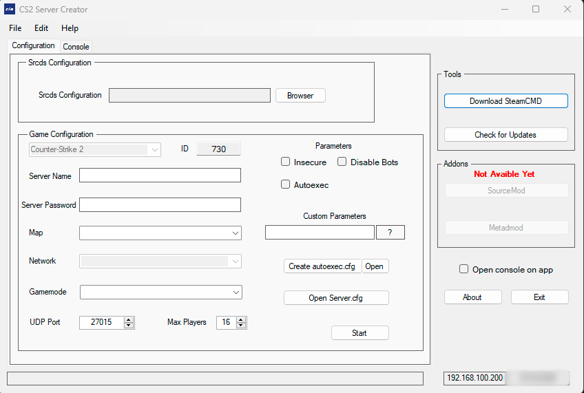
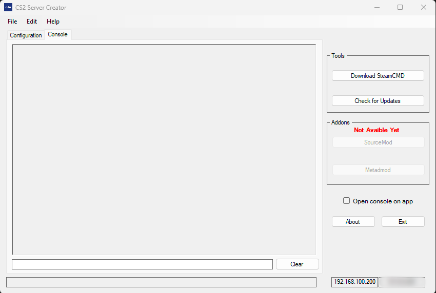

    

  

<h1 align="center">CS2 Server Creator</h1>

    CS2 Server Creator allows you to set up servers for CS2 in an easy, fast, and intuitive manner. 
    It's a project based on the well-known <a href="https://github.com/DioJoestar/SteamCMD-GUI#steamcmd-gui">SteamCMD GUI</a>.  
    <strong>The code is not related or tied to that project in any way.</strong>  
    This application allows for modification of common files for server setup, as well as the generation of files such as autoexec.cfg to further configure the server.

## Table of Contents
- [Preview](#preview)
- [Tutorial](#tutorial)
  - [Srcds Configuration](#step-1-srcds-configuration)
  - [Server Name](#step-2-server-name)
  - [Server Password](#step-3-server-password)
  - [Map](#step-4-map)
  - [Network](#step-5-network)
  - [Gamemode](#step-6-gamemode)
  - [UDP Port](#step-7-udp-port)
  - [Max Players](#step-8-max-players)
  - [Disable Bots](#step-9-disable-bots)
  - [Insecure/Secure](#step-10-insecure-secure)
  - [Autoexec](#step-11-autoexec)
  - [Custom Parameters](#step-12-custom-parameters)
  - [InApp Console](#step-13-inapp-console)
- [Scripting](#scripting)
- [Known Bugs](#known-bugs- )

## Preview

  
  

## Download

To use **CS2 Server Creator**, follow these steps:

1. Visit the [releases page](https://github.com/Natxo09/CS2Server-Creator/releases).
2. Download the latest version.
3. Extract the downloaded file - the application is portable.

## Tutorial

### Step 1: Srcds Configuration
Select the directory of the `cs2.exe`. For example: 
`C:\Program Files (x86)\Steam\steamapps\common\Counter-Strike Global Offensive\game\bin\win64`

### Step 2: Server Name
To modify this section, you must have generated the `autoexec.cfg` using the button on the right.

### Step 3: Server Password
Similar to the `Server Name`, you need to have the `autoexec.cfg` created.

### Step 4: Map
Choose the map for your server. (If you have set the execution of a map with +map {MapName} in [Custom Parameters](#step-11-custom-parameters), leave this combo box empty..)

### Step 5: Network
Not Available Yet.

### Step 6: Gamemode
Select the desired game mode. Remember, based on the game mode you choose, you will need to modify the respective CFGs.

### Step 7: UDP Port
Select the server port.

### Step 8: Max Players
Set the maximum number of players for the server (Up to 64).

### Step 9: Disable Bots
Turn off the server bots.

### Step 10: Insecure-Secure
Activate or deactivate the launch parameter of `-insecure` or `-secure`. By default, it is deactivated, meaning the server will run with `-secure`.  
If the checkBox is activated, it will run in `-insecure` mode. If you want to run the server with a custom map, you will need to use insecure as CS2 still doesn't support running unofficial maps securely.

### Step 11: Autoexec
Enable or disable the execution of `autoexec`.

### Step 12: Custom Parameters
Allows you to add custom launch parameters. Be sure not to duplicate launch parameters integrated into the program to avoid conflicts and server errors. It can be used with the following syntax to execute a custom map: `+map {MapName}`.

### Step 13: InApp Console
If you check the CheckBox `Open console on app`, this will cause the server logs to open in the `console` section instead of the cs2 console. 
This is useful for monitoring `logs` and saving them (coming soon). Currently, the `-hideconsole` parameter doesn't work with cs2, so even if you check the `Open console on app` option, 
the empty cs2 console will still pop up. If the sole purpose of using the application is to open the server and then close the application, I don't recommend using this option as you will lose the server logs.

## Scripting
If anyone knows about scripting for CS2 servers, please contact me. Thank you.

## Known Bugs 🐛
- **The cs2 console still opens even when `Open console on app` is selected**: This happens because the  
`-hideconsole` argument might not yet be incorporated into cs2, making it inevitable that it will open.
- The `Faceit Anticheat` does not allow interaction with `cs2.exe`, which means that when this application is running, it will result in an `Access Denied` error.  
  In this situation, there's nothing I can do, as it could cause malfunctions and even lead the anticheat to detect it as a cheat. Therefore, 
  I do not recommend using the application while the `Faceit Anticheat` is running. The application is completely safe as it only uses commands and arguments provided by `Valve` in their forums.

---

Any issues, please refer to the [issues](https://github.com/Natxo09/CS2Server-Creator/issues) section or contact us directly. 
P.S. This is my first public project. I hope everything goes smoothly. :=

